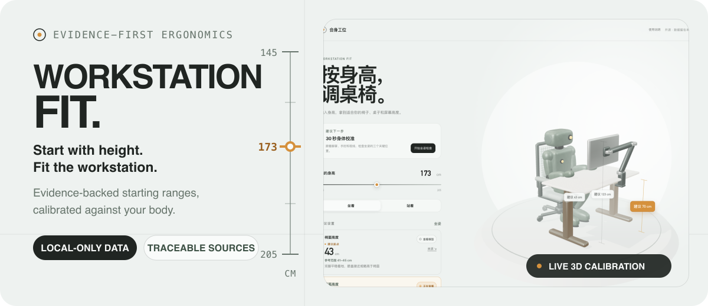
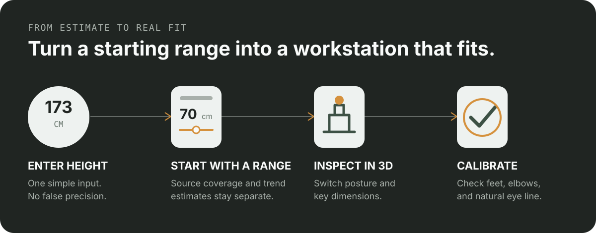

<p align="center">
  <a href="./README.md">简体中文</a>
  ·
  <strong>English</strong>
</p>

<p align="center">
  
</p>

<p align="center">
  <a href="https://fit.barrybarrywu.cn"><strong>Live demo</strong></a>
  ·
  <a href="#run-locally">Run locally</a>
  ·
  <a href="#method-and-limits">Method and limits</a>
  ·
  <a href="#license">License</a>
</p>

Workstation Fit is an open-source ergonomic workstation calculator for Chinese adult office users. Enter your height to see suggested starting ranges for seat height, sitting and standing desk height, monitor-top height, and viewing distance. Then use your feet, elbows, and natural eye line to adjust those numbers to your actual body and equipment.

Every calculation runs in the browser. Your height, guide state, and calibration progress stay on the current device and are never uploaded to a server. The current product interface is in Simplified Chinese.

<p align="center">
  
</p>

## The problem it addresses

Many workstation calculators return one precise-looking number without showing where it came from or acknowledging that people with the same height can have different leg, torso, arm, and eye proportions.

Workstation Fit separates the result into three layers:

- **Suggested start:** a practical first setting for the chair, desk, and monitor.
- **Reference range:** room to adjust instead of presenting one number as the “ideal height.”
- **Body calibration:** observable checks for your feet, knees, elbows, and eye line before you settle on the real setup.

<p align="center">
  
</p>

## Features

- Calculates starting ranges for seat height, sitting desk height, standing desk height, and monitor-top height.
- Switches between sitting and standing while the Three.js scene updates to match.
- Lets you inspect each recommendation directly in the 3D model.
- Provides a 30-second body check for the chair, desk, and monitor.
- Shows the source, adopted data, transformation, coverage, and limitations behind every displayed measurement.
- Separates results inside the source coverage from trend estimates outside it.
- Supports keyboard navigation, reduced-motion preferences, and a non-WebGL fallback.

## Run locally

You need Node.js and npm.

```bash
npm install
npm run dev
```

Open the local address printed in the terminal. The calculator does not require a database, account, or backend service.

## Method and limits

The default model is intended for Chinese adults using conventional office chairs, desks, and monitors. Height is only a quick entry point. The final setup still needs adjustment for individual body proportions, footwear, seat compression, equipment dimensions, and the work being performed.

- The primary anthropometric source is `GB/T 10000—2023, Human dimensions of Chinese adults`; occupational-health and ergonomic guidance supports the physical calibration checks.
- Every displayed measurement has an independent evidence chain. Brand calculators and tools without a transparent derivation are not treated as numerical authority.
- Results outside the original source coverage are labeled as trend estimates rather than direct source data.
- Monitor viewing distance uses the overlapping guidance range of `50–75 cm` instead of inventing one falsely precise target.
- The results are starting points for workstation setup, not a substitute for a professional ergonomic assessment or medical advice.

The complete sources and transformations are available in the product's “数值，怎么来的” evidence section.

## Technology

- [Astro](https://astro.build/) for the static site and build
- [TypeScript](https://www.typescriptlang.org/) for calculations, state, and interaction logic
- [Three.js](https://threejs.org/) for the original robot and adjustable workstation scene
- [Vitest](https://vitest.dev/) for calculation tests
- [Playwright](https://playwright.dev/) for browser interaction tests

## Validation

```bash
npm test
npx tsc --noEmit
npm run build
npm run test:browser
```

## License

Source code and Blender Python scripts are available under the [MIT License](./LICENSE). Original concept art, Blender scenes, rendered previews, textures, and GLB models are available under [CC BY 4.0](./LICENSE-ASSETS.md) with the following attribution:

> Workstation Fit visual assets by Barry Wu.
