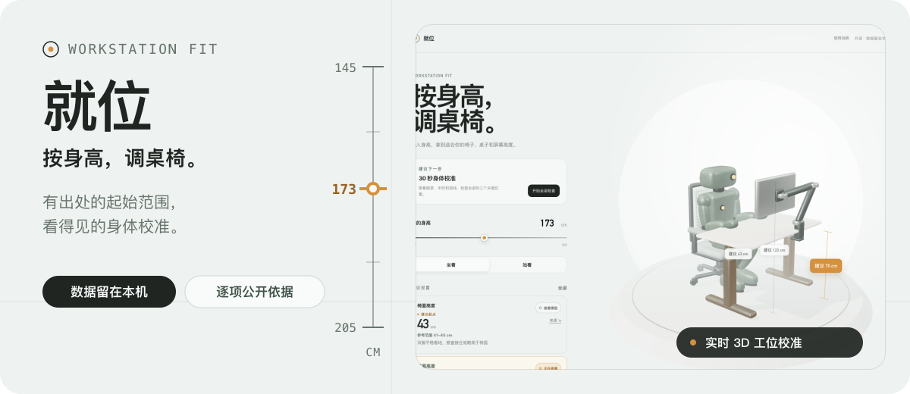
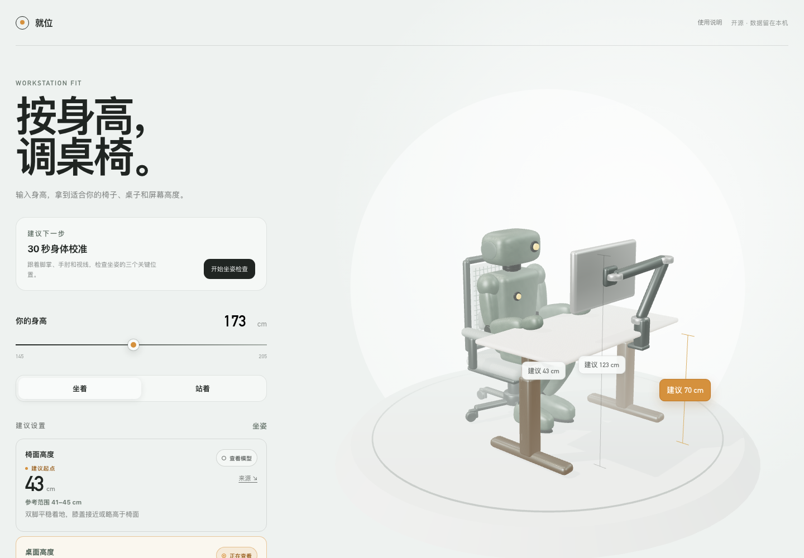
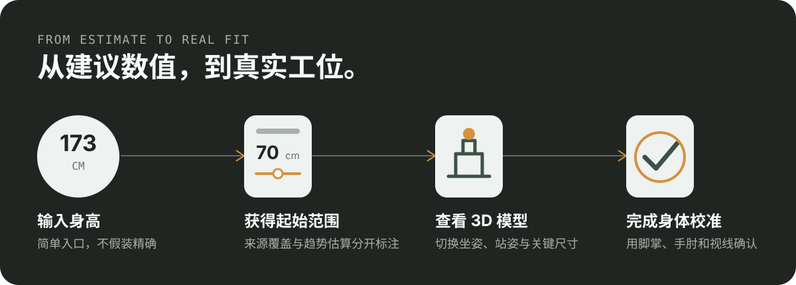

<p align="center">
  <strong>简体中文</strong>
  ·
  <a href="./README.en.md">English</a>
</p>

<p align="center">
  
</p>

<p align="center">
  <a href="https://fit.barrybarrywu.cn"><strong>在线体验</strong></a>
  ·
  <a href="#本地运行">本地运行</a>
  ·
  <a href="#计算原则与边界">计算原则</a>
  ·
  <a href="#许可证">许可证</a>
</p>

就位是一个开源的人体工学桌椅与显示器高度工具。输入身高，就能查看椅面、坐站桌、显示器顶部与观看距离的建议起始范围；再对照脚掌、手肘和视线，把数值调整成真正适合自己的设置。

所有计算都在浏览器中完成。身高、使用说明状态和校准进度只保存在当前设备，不会上传到服务器。

<p align="center">
  
</p>

## 它解决什么问题

很多工位计算器会给出一个看起来非常精确的数字，却不说明来源，也不提醒你每个人的腿长、躯干、手臂和视线比例都不同。

就位把结果拆成三个层次：

- **建议起点**：先给出一个容易落地的椅子、桌面和显示器设置值。
- **参考范围**：保留合理调整空间，不把单一数字包装成“最佳高度”。
- **身体校准**：跟着脚掌、膝盖、手肘和视线逐项检查，再调整真实设备。

<p align="center">
  
</p>

## 主要功能

- 根据身高计算椅面、坐姿桌面、站姿桌面和显示器顶部的起始范围。
- 在坐姿与站姿之间切换，并让 Three.js 场景同步展示对应工位。
- 单独查看每项建议在三维模型中的位置。
- 用 30 秒身体检查确认椅子、桌面和显示器是否合适。
- 为每项数值公开来源、采用数据、换算方式、适用范围和局限。
- 明确区分来源覆盖内的参考结果与覆盖外的趋势估算。
- 支持键盘操作、减少动态效果偏好和无 WebGL 时的降级显示。

## 本地运行

需要 Node.js 和 npm。

```bash
npm install
npm run dev
```

打开终端显示的本地地址，即可使用完整计算器。项目不需要数据库、账户或后端服务。

## 计算原则与边界

这个项目面向使用普通办公桌椅与显示器的中国成年办公用户。身高只是快速入口，最终设置仍要根据个人身体比例、鞋底厚度、坐垫压缩、设备尺寸和工作内容进行校准。

- 人体尺寸主要参考 `GB/T 10000—2023《中国成年人人体尺寸》`，校准规则补充参考职业健康与人体工学机构公开资料。
- 每项结果都有独立证据链；品牌计算器和未公开推导过程的工具不会被当作数值依据。
- 超出原始资料覆盖范围的结果会标记为趋势估算，不会伪装成直接测量结论。
- 显示器观看距离采用多份专业指南的重叠范围 `50–75 cm`，不制造一个虚假的精确中点。
- 结果只用于帮助设置工位，不能替代专业人体工学评估或医疗建议。

完整来源与换算说明可以在网页的“数值，怎么来的”部分逐项查看。

## 技术组成

- [Astro](https://astro.build/)：静态页面与构建
- [TypeScript](https://www.typescriptlang.org/)：计算、状态与交互逻辑
- [Three.js](https://threejs.org/)：原创机器人与可调工位场景
- [Vitest](https://vitest.dev/)：计算逻辑测试
- [Playwright](https://playwright.dev/)：浏览器交互测试

## 验证

```bash
npm test
npx tsc --noEmit
npm run build
npm run test:browser
```

## 许可证

源代码和 Blender Python 脚本采用 [MIT License](./LICENSE)。原创概念图、Blender 场景、渲染图、纹理和 GLB 模型采用 [CC BY 4.0](./LICENSE-ASSETS.md)，使用时请注明：

> Workstation Fit visual assets by Barry Wu.
